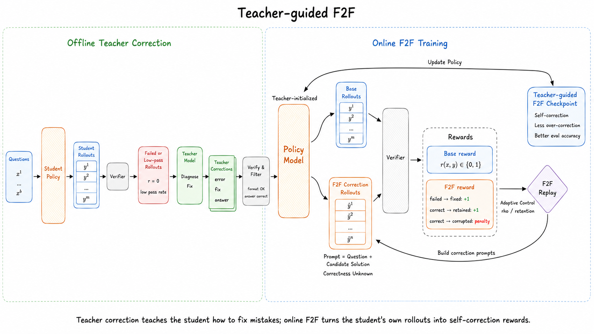
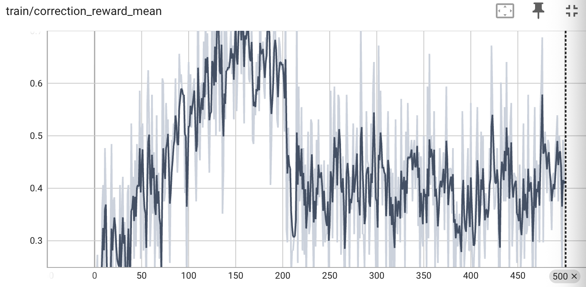
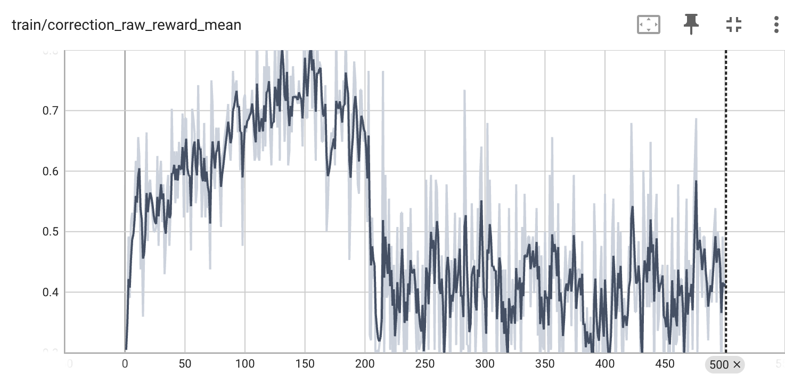
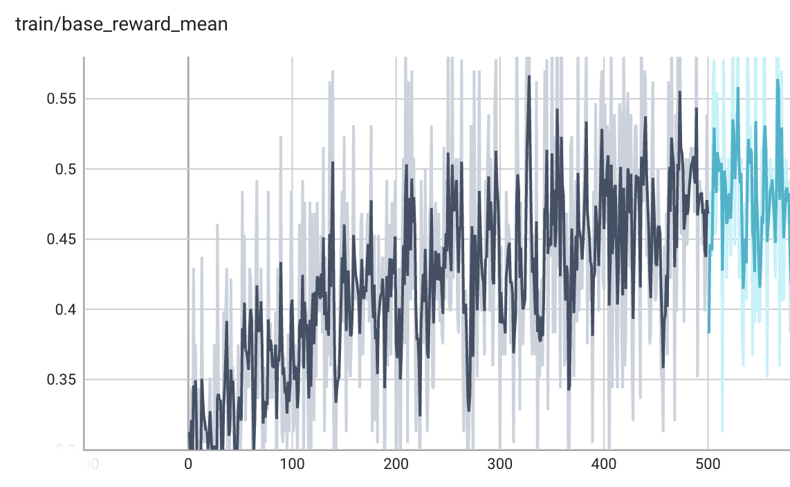
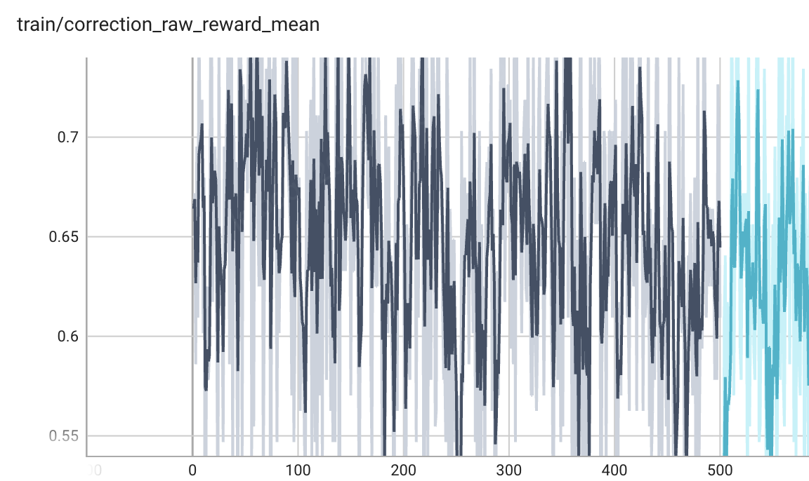
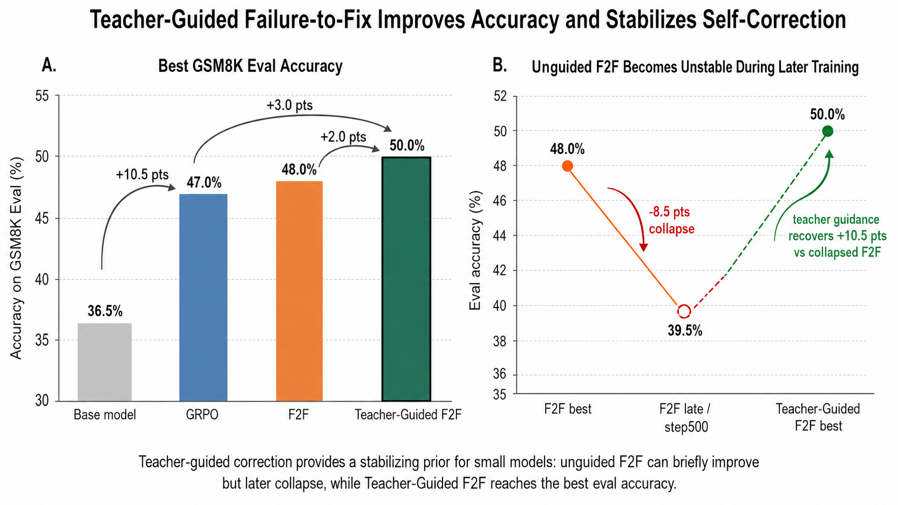

# Fail2Fix-RL

**Teacher-guided Failure-to-Fix reinforcement learning for small reasoning models.**

Fail2Fix-RL is a compact research framework for training small reasoning models to repair their own failed rollouts. The current implementation targets GSM8K-style verifiable math reasoning, Qwen2.5-0.5B-Instruct-scale models, and single-GPU experiments.

The project sits in the broader line of self-improving language models, self-distillation, and verifiable reward learning. The public code is organized as a clean, runnable framework rather than a dump of one-off experiment scripts.

[中文介绍](README.zh-CN.md)

## Framework



The framework has two stages:

1. **Offline teacher correction**: sample student rollouts, select failed or low-pass-rate attempts, ask a strong teacher model to diagnose and fix them, and keep only corrections that pass the deterministic verifier.
2. **Online F2F training**: run base problem-solving rollouts and correction rollouts in the same RL loop, then optimize the policy with verifiable rewards, correction replay, adaptive anchor selection, and risk-aware penalties.

## Why This Exists

RLVR on math tasks often reduces feedback to a sparse binary reward: the final answer is either correct or incorrect. That signal is objective, but it ignores useful structure inside failed reasoning traces. A near miss, a small arithmetic slip, and a fully irrelevant solution all receive the same score.

Fail2Fix-RL turns model-generated failures into training material. The student first solves the problem normally. Then selected candidate solutions are replayed as "possibly wrong" traces, and the student learns to check, preserve, or repair them.

## Why Teacher Guidance Matters

The teacher-guided stage was added because unguided self-correction is a poor cold start for very small models. In preliminary runs, the policy was asked to build correction prompts from its own rollouts and learn only from binary verifier feedback. The correction reward rose for a while, but then dropped sharply around the middle of training and stayed noisy instead of converging. The raw correction reward showed the same pattern: early improvement, followed by a severe decline and unstable oscillation.

| Unguided correction reward | Unguided raw correction reward |
| --- | --- |
|  |  |

After teacher-correction initialization, the pilot dynamics are qualitatively different. The base reward shows a gradual upward trend over the first 500 steps, while the correction raw reward stays mostly in a higher band despite the noise expected from online RL.

| Teacher-guided base reward | Teacher-guided correction raw reward |
| --- | --- |
|  |  |

This contrast is the main motivation for the teacher-guided design. For sub-billion-parameter students, failed rollouts are often too noisy to serve as reliable teaching material; a binary verifier says whether the final answer is right, but not how the reasoning should be repaired; and correction prompts can accidentally teach over-editing, where the model changes answers that were already correct. Teacher-guided correction SFT gives the student a minimal correction prior before online RL: how to diagnose an error, when to preserve a valid solution, how to produce a verifier-friendly final answer, and how to turn a failed attempt into a fixed trajectory. Online F2F then continues with the student's own rollouts rather than depending on the teacher at every RL step.

## Pilot Results



On GSM8K eval, the best observed pilot accuracy was 36.5% for the base model, 47.0% for GRPO, 48.0% for unguided F2F, and 50.0% for Teacher-Guided F2F. The same runs also show why the best-number comparison is not the whole story: unguided F2F briefly improves but later collapses to 39.5%, while Teacher-Guided F2F keeps the best eval score in this pilot comparison.

## Released Teacher-Correction Data

The Mimo-generated correction dataset used for teacher-guided initialization is included in:

```text
released_data/mimo_teacher_corrections_gsm8k/
```

It contains 3,676 verified correction SFT examples generated from GSM8K student failures with `mimo-v2.5-pro`. Each row includes the original question, failed student solution, structured teacher diagnosis, and the verified correction target. For ordinary SFT, use the `prompt` and `response` fields.

## Core Method

Each online RL step uses two streams:

```text
problem
  -> base rollouts
  -> verifier
  -> grouped RL advantage

problem + candidate solution
  -> correction rollouts
  -> verifier
  -> F2F correction reward + risk-aware shaping
```

Key mechanisms:

- **Failure-to-fix replay**: correction prompts are built from the current policy's own rollouts.
- **Teacher-guided initialization**: verified teacher corrections can be used for SFT before online RL.
- **Difficulty-aware selection**: mixed-success prompts are prioritized because they carry stronger learning signal.
- **Adaptive rho control**: the correct-vs-failed anchor ratio changes with correction retention.
- **Risk-aware reward shaping**: corrupting an already-correct solution is penalized.
- **Deterministic verifier**: final answers are extracted and compared with numeric/symbolic equivalence rules.

## Repository Scope

This repository keeps only reusable framework code: data preparation, rollout collection, teacher correction generation, correction SFT, online F2F RL, GRPO baseline training, and evaluation. Checkpoints, raw datasets, TensorBoard logs, run-specific monitors, ad hoc analysis scripts, and result tables are intentionally excluded so final paper/PPT artifacts can be curated separately.

## Repository Layout

```text
assets/
  f2f_framework.png                 Framework diagram.
  f2f_eval_summary.png              Pilot eval summary figure.

released_data/
  mimo_teacher_corrections_gsm8k/   Verified Mimo correction SFT data.

remote_scripts/
  prepare_gsm8k_grpo_data.py        Convert ModelScope GSM8K into RL JSONL.
  collect_student_rollouts.py       Generate multi-sample student rollouts.
  build_teacher_corrections.py      Build verified teacher correction SFT data.
  train_correction_sft.py           Full-parameter correction SFT.
  train_f2f_online_rl.py            Online F2F RL training loop.
  train_grpo_base.py                Vanilla GRPO baseline.
  eval_gsm8k_subset.py              Deterministic GSM8K subset evaluation.
  eval_correction_sft.py            Correction-prompt evaluation.

verifier_math.py                    Answer extraction and equivalence checks.
requirements.txt                    Python dependencies.
```

## Quick Start

Install dependencies in the training environment:

```bash
pip install -r requirements.txt
```

Prepare GSM8K:

```bash
python remote_scripts/prepare_gsm8k_grpo_data.py \
  --output-dir data/gsm8k_grpo
```

Collect student rollouts:

```bash
python remote_scripts/collect_student_rollouts.py \
  --model Qwen/Qwen2.5-0.5B-Instruct \
  --data data/gsm8k_grpo/train.jsonl \
  --output data/teacher_correction/student_rollouts_train.jsonl \
  --limit 512 \
  --group-size 8
```

Generate verified teacher corrections:

```bash
cp .env.example .env.teacher

python remote_scripts/build_teacher_corrections.py \
  --rollouts data/teacher_correction/student_rollouts_train.jsonl \
  --output data/teacher_correction/correction_sft_train.jsonl \
  --cache data/teacher_correction/teacher_cache.jsonl
```

Run correction SFT:

```bash
python remote_scripts/train_correction_sft.py \
  --model Qwen/Qwen2.5-0.5B-Instruct \
  --data data/teacher_correction/correction_sft_train.jsonl \
  --output-dir checkpoints/f2f_correction_sft
```

Continue with online F2F RL:

```bash
python remote_scripts/train_f2f_online_rl.py \
  --model checkpoints/f2f_correction_sft \
  --train-data data/gsm8k_grpo/train.jsonl \
  --eval-data data/gsm8k_grpo/test.jsonl \
  --output-dir checkpoints/f2f_online \
  --max-steps 500 \
  --batch-size 8 \
  --group-size 8 \
  --max-new-tokens 1024 \
  --tensorboard
```

Run the GRPO baseline:

```bash
python remote_scripts/train_grpo_base.py \
  --model Qwen/Qwen2.5-0.5B-Instruct \
  --data data/gsm8k_grpo/train.jsonl \
  --output-dir checkpoints/grpo_base \
  --report-to-tensorboard
```

Evaluate a checkpoint:

```bash
python remote_scripts/eval_gsm8k_subset.py \
  --model checkpoints/f2f_online/best_eval_checkpoint \
  --data data/gsm8k_grpo/test.jsonl \
  --limit 200 \
  --output-dir reports/eval_gsm8k
```

## Related Work

Fail2Fix-RL is closest to the intersection of self-generated supervision, self-correction, and verifiable reward training.

**Self-generated data and self-distillation.** Self-Instruct shows that models can synthesize instruction data for later instruction tuning ([Wang et al., 2022](https://arxiv.org/abs/2212.10560)). Large Language Models Can Self-Improve uses high-confidence chain-of-thought samples from unlabeled data as self-training targets ([Huang et al., 2022](https://arxiv.org/abs/2210.11610)). STaR bootstraps reasoning by generating rationales, keeping those that lead to correct answers, and fine-tuning on them iteratively ([Zelikman et al., 2022](https://arxiv.org/abs/2203.14465)). ReST-EM generalizes this generate-filter-finetune loop to problem solving with scalar feedback ([Singh et al., 2023](https://arxiv.org/abs/2312.06585)). SPIN frames self-improvement as self-play fine-tuning against previous model generations ([Chen et al., 2024](https://arxiv.org/abs/2401.01335)). Instruction Backtranslation is another self-alignment route that creates instruction-response data from raw text ([Li et al., 2023](https://arxiv.org/abs/2308.06259)).

**Self-correction and feedback-driven refinement.** Self-Refine improves outputs through iterative self-feedback at inference time without changing model weights ([Madaan et al., 2023](https://arxiv.org/abs/2303.17651)). Reflexion turns feedback into verbal memory for future attempts, especially in agentic coding and decision tasks ([Shinn et al., 2023](https://arxiv.org/abs/2303.11366)). Process-supervision work such as Let's Verify Step by Step shows why final-answer supervision can be too coarse for multi-step reasoning, and why verifier or reward-model feedback can be more informative ([Lightman et al., 2023](https://arxiv.org/abs/2305.20050)).

**Failure-to-fix RL.** Fail2Fix-RL differs from pure self-training by explicitly replaying the student's own candidate solutions as correction prompts. Teacher corrections provide an initial self-correction prior, while online F2F RL keeps generating new base and correction rollouts from the current policy. Closely related correction-oriented RLVR work also studies how failed trajectories can be converted into correction supervision ([Ren et al., 2026](https://arxiv.org/abs/2605.14539)); this repository keeps that line as background while focusing on a teacher-guided F2F training recipe.

## Reproducibility Notes

- Training scripts assume a CUDA environment for practical speed.
- Full-parameter Qwen2.5-0.5B runs were developed on a 48GB RTX 4090 setup.
- API keys should only live in local environment files such as `.env.teacher`.
- Raw datasets, checkpoints, generated rollouts, logs, and TensorBoard event files are ignored by git.

## Citation

If you use this project in a report or presentation, cite it as an experimental framework for teacher-guided self-correction and verifiable reward learning:

```text
Fail2Fix-RL: Teacher-guided Failure-to-Fix Reinforcement Learning.
Research prototype, 2026.
```
